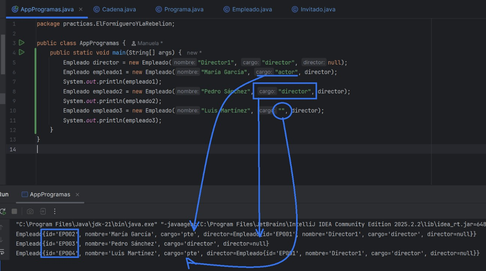

# Práctica 1. "El Formiguero" y "La Rebelión"

Manuela Planelles - 1º DAW - IES Mutxamel

---

## Índice

1. [Introducción](https://github.com/manuelaplanelles/1Daw/blob/main/javabasico/src/main/java/practicas/ElFormigueroYLaRebelion/README.md#1-introducci%C3%B3n)
2. [Objetivos de la práctica](https://github.com/manuelaplanelles/1Daw/blob/main/javabasico/src/main/java/practicas/ElFormigueroYLaRebelion/README.md#2-objetivos-de-la-pr%C3%A1ctica)
3. [Diseño e Implementación del programa.](https://github.com/manuelaplanelles/1Daw/blob/main/javabasico/src/main/java/practicas/ElFormigueroYLaRebelion/README.md#3-dise%C3%B1o-e-implementaci%C3%B3n-del-programa)
   - [3.1. Estructura de clases](https://github.com/manuelaplanelles/1Daw/blob/main/javabasico/src/main/java/practicas/ElFormigueroYLaRebelion/README.md#31-estructura-de-clases)
     - [3.1.1. Clase `AppProgramas`](https://github.com/manuelaplanelles/1Daw/blob/main/javabasico/src/main/java/practicas/ElFormigueroYLaRebelion/README.md#clase-appprogramas)
     - [3.1.4. Clase `Empleado`](https://github.com/manuelaplanelles/1Daw/blob/main/javabasico/src/main/java/practicas/ElFormigueroYLaRebelion/README.md#clase-empleado)
     - [3.1.5. Clase `Invitado`](https://github.com/manuelaplanelles/1Daw/blob/main/javabasico/src/main/java/practicas/ElFormigueroYLaRebelion/README.md#clase-invitado)
     - [3.1.2. Clase `Cadena`](https://github.com/manuelaplanelles/1Daw/blob/main/javabasico/src/main/java/practicas/ElFormigueroYLaRebelion/README.md#clase-cadena)
     - [3.1.3. Clase `Programa`](https://github.com/manuelaplanelles/1Daw/blob/main/javabasico/src/main/java/practicas/ElFormigueroYLaRebelion/README.md#clase-programa)
   - [3.2. Métodos extras implementados.](https://github.com/manuelaplanelles/1Daw/blob/main/javabasico/src/main/java/practicas/ElFormigueroYLaRebelion/README.md#32-m%C3%A9todos-extras-implementados)
4. [Relaciones entre clases](https://github.com/manuelaplanelles/1Daw/blob/main/javabasico/src/main/java/practicas/ElFormigueroYLaRebelion/README.md#4-relaciones-entre-clases)
5. [Ejemplo de funcionamiento](https://github.com/manuelaplanelles/1Daw/blob/main/javabasico/src/main/java/practicas/ElFormigueroYLaRebelion/README.md#5-ejemplo-de-funcionamiento)
6. [Plan de pruebas](https://github.com/manuelaplanelles/1Daw/blob/main/javabasico/src/main/java/practicas/ElFormigueroYLaRebelion/README.md#6-plan-de-pruebas)
   - [6.1. Pruebas final feliz.](https://github.com/manuelaplanelles/1Daw/blob/main/javabasico/src/main/java/practicas/ElFormigueroYLaRebelion/README.md#61-pruebas-final-feliz)
   - [6.2. Pruebas con JUnit5.](https://github.com/manuelaplanelles/1Daw/blob/main/javabasico/src/main/java/practicas/ElFormigueroYLaRebelion/README.md#62-pruebas-con-junit5)
7. [Documentación Javadoc](https://github.com/manuelaplanelles/1Daw/blob/main/javabasico/src/main/java/practicas/ElFormigueroYLaRebelion/README.md#7-documentaci%C3%B3n-javadoc)
8. [Diagrama UML:** Crear el diagrama UML con PlantUML.](https://github.com/manuelaplanelles/1Daw/blob/main/javabasico/src/main/java/practicas/ElFormigueroYLaRebelion/README.md#8-diagrama-uml-crear-el-diagrama-uml-con-plantuml)

---


## 1. Introducción.

El presente documento recoge el desarrollo de la práctica número 1 de la asignatura de Programación 1, correspondiente al módulo de Desarrollo de Aplicaciones Web. 

El contexto de la práctica se centra en el mundo de la televisión, donde se observa una situación de confrontación entre distintos programas. El objetivo es desarrollar una aplicación que permita recoger datos diarios sobre estos programas para aportar objetividad a las distintas informaciones que van surgiendo.

---

## 2. Objetivos de la práctica.

La práctica persigue los siguientes objetivos:

- Desarrollar una aplicación en Java que gestione información sobre cadenas de televisión, programas, empleados e invitados.
- Implementar relaciones de **composición** entre las clases `Programa`, `Empleado` e `Invitado`.
- Implementar relaciones de **asociación/agregación bidireccional** entre las clases `Cadena` y `Programa`.
- Aplicar conceptos de Programación Orientada a Objetos: encapsulación, constructores, getters, setters y sobreescritura de métodos.
- Implementar métodos de gestión de colecciones (ArrayList).
- Desarrollar métodos específicos de búsqueda y filtrado de información.

---

## 3. Diseño e Implementación del programa.

### 3.1. Estructura de clases

Creamos las clases que se solicitan con sus atributos.


---
#### Clase AppProgramas
Creamos la clase AppProgramas, unicamente con el main e iremos completandola para las pruebas.
```java
public class AppProgramas {
    public static void main(String[] args) {

    }
}
```
---

#### Clase Empleado
- Para generar el Id automático creamos la función .format para formatear el número con 3 digitos y un contador que va incrementando
```java
private String generarId(){
        String id = String.format("EP%03d", contadorId);
        contadorId++;
        return id;
    }
```
- Creamos el contructor llamando a setCargo para validar el cargo y comprobar que si es director sea nulo.
```java
 public Empleado(String nombre, String cargo, Empleado director) {
        this.id = generarId();
        this.nombre = nombre;
        setCargo(cargo);

        if (this.cargo.equals("director")) {
            this.director = null;
        } else {
            this.director = director;
        }
    }
```
- Le damos valores a cargo y si no es uno de eso se indica con valor por defecto null. Esto lo indicamos en el método setCargo.
```java
   public void setCargo(String cargo) {
        String[] cargosValidos = {"director", "técnico", "presentador", "colaborador"};
        boolean esValido = false;

        for (String cargoValido : cargosValidos) {
            if (cargoValido.equalsIgnoreCase(cargo)) {
                esValido = true;
                break;
            }
        }
        if (esValido) {
            this.cargo = cargo.toLowerCase();
        } else {
            this.cargo = "pte";
        }
    }
 ```
- Sobre escribimos el método toString, para mostrar el nombre del director o  si no hay.
```java
 @Override
    public String toString() {
        String directorInfo = (director != null) ? director.getNombre() : "Sin director (es director)";
        return "Empleado{" +
                "id='" + id + '\'' +
                ", nombre='" + nombre + '\'' +
                ", cargo='" + cargo + '\'' +
                ", director=" + directorInfo +
                '}';
    }
```

<details>
<summary>Ver el código completo de la clase Empleado</summary>

```java
public class Empleado {
    private static int contadorId = 1;
    private String id;
    private String nombre;
    private String cargo;
    private Empleado director;

    private String generarId(){
        String id = String.format("EP%03d", contadorId);
        contadorId++;
        return id;
    }
    public Empleado(String nombre, String cargo, Empleado director) {
        this.id = generarId();
        this.nombre = nombre;
        setCargo(cargo);

        if (this.cargo.equals("director")) {
            this.director = null;
        } else {
            this.director = director;
        }
    }


    public static int getContadorId() {
        return contadorId;
    }

    public static void setContadorId(int contadorId) {
        Empleado.contadorId = contadorId;
    }

    public String getId() {
        return id;
    }

    public void setId(String id) {
        this.id = id;
    }

    public String getNombre() {
        return nombre;
    }

    public void setNombre(String nombre) {
        this.nombre = nombre;
    }

    public String getCargo() {
        return cargo;
    }

    public void setCargo(String cargo) {
        String[] cargosValidos = {"director", "técnico", "presentador", "colaborador"};
        boolean esValido = false;

        for (String cargoValido : cargosValidos) {
            if (cargoValido.equalsIgnoreCase(cargo)) {
                esValido = true;
                break;
            }
        }
        if (esValido) {
            this.cargo = cargo.toLowerCase();
        } else {
            this.cargo = "pte";
        }
    }

    public Empleado getDirector() {
        return director;
    }

    public void setDirector(Empleado director) {
        this.director = director;
    }

    @Override
    public String toString() {
        String directorInfo = (director != null) ? director.getNombre() : "Sin director (es director)";
        return "Empleado{" +
                "id='" + id + '\'' +
                ", nombre='" + nombre + '\'' +
                ", cargo='" + cargo + '\'' +
                ", director=" + directorInfo +
                '}';
    }
}
```

</details>

[Comprobación 1.](https://github.com/manuelaplanelles/1Daw/blob/main/javabasico/src/main/java/practicas/ElFormigueroYLaRebelion/README.md#comprobamos-la-lista-de-empleados-un-empleado-no-puede-ser-director-y-si-no-es-ning%C3%BAn-de-los-valores-se-guarda-como-pte)

---

#### Clase Invitado
- La única condición es que la la fecha por defecto (LocalDate) y se crean los atriburos, el constructor, los set, los get y toString.

<details>
<summary>Ver el código completo de la clase Invitado</summary>

```java
import java.time.LocalDate;

public class Invitado {
    private String nombre;
    private String profesion;
    private LocalDate fecha_visita;
    private int temporada;

    public Invitado (String nombre, String profesion, int temporada){
        this.nombre = nombre;
        this.profesion = profesion;
        this.temporada = temporada;
        this.fecha_visita = LocalDate.now();
    }


    public String getNombre() {
        return nombre;
    }

    public void setNombre(String nombre) {
        this.nombre = nombre;
    }

    public String getProfesion() {
        return profesion;
    }

    public void setProfesion(String profesion) {
        this.profesion = profesion;
    }

    public LocalDate getFecha_visita() {
        return fecha_visita;
    }

    public void setFecha_visita(LocalDate fecha_visita) {
        this.fecha_visita = fecha_visita;
    }

    public int getTemporada() {
        return temporada;
    }

    public void setTemporada(int temporada) {
        this.temporada = temporada;
    }

    @Override
    public String toString() {
        return "Invitado{" +
                "nombre='" + nombre + '\'' +
                ", profesion='" + profesion + '\'' +
                ", fecha_visita=" + fecha_visita +
                ", temporada=" + temporada +
                '}';
    }
}

```
</details>

 [Comprobación 2.](https://github.com/manuelaplanelles/1Daw/blob/main/javabasico/src/main/java/practicas/ElFormigueroYLaRebelion/README.md#comprobamos-que-se-crea-sin-problema-invitado)
 
---

#### Clase Cadena
- Creamos atributos, el constructor, los set, los get y toString.
- Creamos método para gestionar la lista de programas, añade un programa (.add) si no es diferente a null y si no esta en la lista.
```java
 public void agregarPrograma(Programa programa) {
        if (programa != null && !listaPrograma.contains(programa)) {
            listaPrograma.add(programa);
        }
    }
```
- Otro método para eliminar un programa de la lista.
```java
 public void eliminarPrograma(Programa programa) {
        listaPrograma.remove(programa);
    }
```
- Se pide que se sobre escriba toString, para mostrar el nombre de la cadena, cuantos programas tiene y los nombres.
```java
   @Override
    public String toString() {
        String resultado = "Cadena: " + nombre + "\n" +
                "Programas: " + listaPrograma.size() + "\n";
        for (Programa programa : listaPrograma) {
            resultado += "  - " + programa.getNombre() + "\n";
        }
        return resultado;
    }
```
<details>
<summary>Ver el código completo de la clase Cadena</summary>

```java
import java.util.ArrayList;

public class Cadena {

    private String nombre;
    private ArrayList<Programa> listaPrograma;

    public Cadena(String nombre) {
        this.nombre = nombre;
        this.listaPrograma = new ArrayList<>();
    }
    public void agregarPrograma(Programa programa) {
        if (programa != null && !listaPrograma.contains(programa)) {
            listaPrograma.add(programa);
        }
    }

    public void eliminarPrograma(Programa programa) {
        listaPrograma.remove(programa);
    }


    public String getNombre() {
        return nombre;
    }

    public void setNombre(String nombre) {
        this.nombre = nombre;
    }

    public ArrayList<Programa> getListaPrograma() {
        return listaPrograma;
    }

    public void setListaPrograma(ArrayList<Programa> listaPrograma) {
        this.listaPrograma = listaPrograma;
    }

    @Override
    public String toString() {
        String resultado = "Cadena: " + nombre + "\n" +
                "Programas: " + listaPrograma.size() + "\n";
        for (Programa programa : listaPrograma) {
            resultado += "  - " + programa.getNombre() + "\n";
        }
        return resultado;
    }
}

```
</details>

 [Comprobación 3.](https://github.com/manuelaplanelles/1Daw/blob/main/javabasico/src/main/java/practicas/ElFormigueroYLaRebelion/README.md#comprobamos-sobre-la-clase-cadena)

---

#### Clase Programa
- Ya teníamos los atributos, ahora creamos el constructor con el contador por defecto 0 de la temporada y creamos las listas vacías, creamos un director y lo metemos en la lista. Y relacionamos la clase cadena y la de programa, creamos los set y los get.
```java
public class Programa {
    private String nombre;
    private Cadena cadena;
    private int temporadas;

    private ArrayList<Empleado>  listaEmpleado = new ArrayList<>();
    private ArrayList<Invitado> listaInvitado = new ArrayList<>();
    private Empleado director;

    public Programa(String nombre, Cadena cadena, String nombreDirector) {
        this.nombre = nombre;
        this.cadena = cadena;
        this.temporadas = 0;

        this.director = new Empleado(nombreDirector, "director", null);
        this.listaEmpleado.add(this.director);

        if (cadena != null) {
            cadena.agregarPrograma(this);
        }
    }
```
- Para cumplir con lo que se indica:
> _“De forma que, si el día de mañana el programa "La rebelión" vuelve a su Cadena original, esta sigue manteniendo todas sus características y solamente necesitaremos modificar el valor del atributo cadena en la clase Programa y eliminar de la listaProgramas en la clase Cadena dicho programa."_

Desde el método setCadena, generamos función if para eliminar la cadena anterior, asignamos la nueva cadena y otro if para añadir la nueva cadena.
```java
 public void setCadena(Cadena cadena) {
        this.cadena = cadena;
        if (this.cadena != null) {
            this.cadena.eliminarPrograma(this);
        }
        this.cadena = cadena;

        if (cadena != null) {
            cadena.agregarPrograma(this);
        }
    }
```
- Para gestionar los empleados e invitados creamos 4 métodos para añadir y eliminar empleados e invitados, usamos un if para que si el cargo no es director, use el director del programa
```java
    public void añadirEmpleado(String nombre, String cargo, Empleado director) {
        if (!cargo.equalsIgnoreCase("director")) {
            director = this.director;
        }
        Empleado nuevoEmpleado = new Empleado(nombre, cargo, director);
        listaEmpleado.add(nuevoEmpleado);
    }

    public void eliminarEmpleado(Empleado empleado) {
        listaEmpleado.remove(empleado);
    }

    public void añadirInvitado(String nombre, String profesion, int temporada) {
        Invitado nuevoInvitado = new Invitado(nombre, profesion, temporada);
        listaInvitado.add(nuevoInvitado);
    }

    public void eliminarInvitado(Invitado invitado) {
        listaInvitado.remove(invitado);
    }
```
- Y creamos y editamos el toString
```java
 @Override
    public String toString() {
        String nombreCadena = (cadena != null) ? cadena.getNombre() : "Sin cadena";
        return "Programa: " + nombre + "\n" +
                "Cadena: " + nombreCadena + "\n" +
                "Temporadas: " + temporadas + "\n" +
                "Director: " + director.getNombre() + "\n" +
                "Empleados: " + listaEmpleado.size() + "\n" +
                "Invitados: " + listaInvitado.size() + "\n";
    }
```
<details>
<summary>Ver el código completo de la clase Programa</summary>

```java
package practicas.ElFormigueroYLaRebelion;

import java.util.ArrayList;

public class Programa {
    private String nombre;
    private Cadena cadena;
    private int temporadas;

    private ArrayList<Empleado>  listaEmpleado = new ArrayList<>();
    private ArrayList<Invitado> listaInvitado = new ArrayList<>();
    private Empleado director;

    public Programa(String nombre, Cadena cadena, String nombreDirector) {
        this.nombre = nombre;
        this.cadena = cadena;
        this.temporadas = 0;

        this.director = new Empleado(nombreDirector, "director", null);
        this.listaEmpleado.add(this.director);

        if (cadena != null) {
            cadena.agregarPrograma(this);
        }
    }
    public void añadirEmpleado(String nombre, String cargo, Empleado director) {
        if (!cargo.equalsIgnoreCase("director")) {
            director = this.director;
        }
        Empleado nuevoEmpleado = new Empleado(nombre, cargo, director);
        listaEmpleado.add(nuevoEmpleado);
    }

    public void eliminarEmpleado(Empleado empleado) {
        listaEmpleado.remove(empleado);
    }

    public void añadirInvitado(String nombre, String profesion, int temporada) {
        Invitado nuevoInvitado = new Invitado(nombre, profesion, temporada);
        listaInvitado.add(nuevoInvitado);
    }

    public void eliminarInvitado(Invitado invitado) {
        listaInvitado.remove(invitado);
    }

    public String getNombre() {
        return nombre;
    }

    public void setNombre(String nombre) {
        this.nombre = nombre;
    }

    public Cadena getCadena() {
        return cadena;
    }

    public void setCadena(Cadena cadena) {
        this.cadena = cadena;
        if (this.cadena != null) {
            this.cadena.eliminarPrograma(this);
        }
        this.cadena = cadena;

        if (cadena != null) {
            cadena.agregarPrograma(this);
        }
    }

    public int getTemporadas() {
        return temporadas;
    }

    public void setTemporadas(int temporadas) {
        this.temporadas = temporadas;
    }

    public ArrayList<Empleado> getListaEmpleado() {
        return listaEmpleado;
    }

    public void setListaEmpleado(ArrayList<Empleado> listaEmpleado) {
        this.listaEmpleado = listaEmpleado;
    }

    public ArrayList<Invitado> getListaInvitado() {
        return listaInvitado;
    }

    public void setListaInvitado(ArrayList<Invitado> listaInvitado) {
        this.listaInvitado = listaInvitado;
    }

    public Empleado getDirector() {
        return director;
    }

    public void setDirector(Empleado director) {
        this.director = director;
    }

    @Override
    public String toString() {
        String nombreCadena = (cadena != null) ? cadena.getNombre() : "Sin cadena";
        return "Programa: " + nombre + "\n" +
                "Cadena: " + nombreCadena + "\n" +
                "Temporadas: " + temporadas + "\n" +
                "Director: " + director.getNombre() + "\n" +
                "Empleados: " + listaEmpleado.size() + "\n" +
                "Invitados: " + listaInvitado.size() + "\n";
    }
}

```

</details>

 [Comprobación 4.](https://github.com/manuelaplanelles/1Daw/blob/main/javabasico/src/main/java/practicas/ElFormigueroYLaRebelion/README.md#comprobamos-sobre-la-clase-programa-la-gestion-de-los-empleados)

 ---
### 3.2. Métodos extras implementados.

> _a) Modifica el constructor de Invitados para que llame al set de fecha_visita con una fecha que le vamos a preguntar al usuario para guardar cuándo tienen que ir al Programa._
> 
Implementamos en el constructor, y tambien pedimos fecha al usuario y llamamos al set de fecha_vista para asignar la fecha
```java
import java.time.LocalDate;
import java.util.Scanner;
public class Invitado {
    private String nombre;
    private String profesion;
    private LocalDate fecha_visita;
    private int temporada;

    public Invitado(String nombre, String profesion, int temporada) {
        this.nombre = nombre;
        this.profesion = profesion;
        this.temporada = temporada;

        Scanner scanner = new Scanner(System.in);
        System.out.println("Introduce la fecha de visita para " + nombre + ":");
        System.out.print("Año (ej: 2025): ");
        int año = scanner.nextInt();
        System.out.print("Mes (1-12): ");
        int mes = scanner.nextInt();
        System.out.print("Día (1-31): ");
        int dia = scanner.nextInt();
        
        setFecha_visita(LocalDate.of(año, mes, dia)); //.of para crear los valores y setFecha para asignar la fecha
    }
    
    // ... resto del código igual ...
}

```
> _b) Método invitadosTemporada(int temporada) que muestre cuántos Invitados han acudido al Programa dada una temporada. Muestra también sus nombres y profesiones._
>

> _c) Método int vecesInvitado(String nombre) que devuelva las veces que ha ido un Invitado al Programa._
>

> _d) Método rastrearInvitado(String nombre) que haga uso del método creado en el apartado anterior e imprima las veces que ha ido un Invitado al Programa, además de mostrar también en qué fechas y temporadas._
>

> _e) Método boolean buscarInvitado(String nombre) para que dado un Invitado sea capaz de buscar si ha acudido a un Programa._
>

> _f) Método invitadoAntes(String nombre) que use el método implementado en el apartado anterior para que en caso de haber devuelto true buscando en dos Programas distintos, muestre en cuál ha estado antes._
>

---

## 4. Relaciones entre clases

| Relación | Tipo | Descripción |
|----------|------|-------------|
| `Programa` — `Empleado` | Composición | Si un objeto Programa se destruye, desaparecen también sus empleados asociados. |
| `Programa` — `Invitado` | Composición | Si un objeto Programa se destruye, desaparecen también sus invitados asociados. |
| `Cadena` — `Programa` | Asociación/Agregación bidireccional | Se conocen la una a la otra y ambas existen por sí solas. |

---
## 5. Ejemplo de funcionamiento

##### 1. Comprobamos la lista de empleados, un empleado no puede ser director, y si no es ningún de los valores se guarda como pte
  
##### 2. Comprobamos que se crea sin problema Invitado
  

##### 3. Comprobamos sobre la clase Cadena
  

##### 4. Comprobamos sobre la clase Programa, la gestion de los empleados
  


---

## 6. Plan de pruebas
### 6.1. Pruebas final feliz.
- Realiza las pruebas manuales necesarias para comprobar que el programa funciona bien.
---
### 6.2. Pruebas con JUnit5.
- Pruebas unitarias de los método implementados con JUnit5.
---
## 7. Documentación Javadoc:
- Comentar el código siguiendo el estándar Javadoc.
---
## 8. Diagrama UML:
- Crear el diagrama UML con PlantUML.

---


