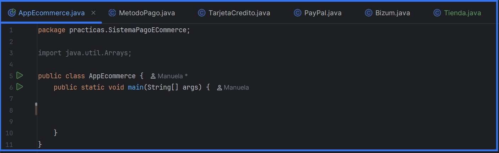

<p align="center">
  
</p>
<h1 align="center"> Práctica 1. Sistema de pago para un e-commerce </h1>
<h2 align="center"> Manuela Planelles - 1º DAW - IES Mutxamel</h2>

---
---

## Índice

1. [Introducción](https://github.com/manuelaplanelles/Java/blob/main/programacion1Daw/src/main/java/practicas/SistemaPagoECommerce/readme.md#1-introducci%C3%B3n)
2. [Objetivos de la práctica](https://github.com/manuelaplanelles/Java/blob/main/programacion1Daw/src/main/java/practicas/SistemaPagoECommerce/readme.md#2-objetivos-de-la-pr%C3%A1ctica)
3. [Diseño e Implementación del programa.]()
   - [3.1. Estructura de clases]()
     - [3.1.1. Clase `AppEcommerce`]()
     - [3.1.2. Clase `MetodoPago`]()
     - [3.1.3. Clase `TarjetaCredito`]()
     - [3.1.4. Clase `PayPal`]()
     - [3.1.5. Clase `Bizum`]()
     - [3.1.6. Clase `Tienda`]()
4. [Relaciones entre clases](https://github.com/manuelaplanelles/Java/blob/main/programacion1Daw/src/main/java/practicas/SistemaPagoECommerce/readme.md#4-relaciones-entre-clases)
5. [Plan de pruebas]()
   - [6.1. Ejemplo de funcionamiento.]()
   - [6.2. Pruebas final feliz.]()
6. [Documentación Javadoc](https://github.com/manuelaplanelles/Java/blob/main/programacion1Daw/src/main/java/practicas/SistemaPagoECommerce/readme.md#6-documentaci%C3%B3n-javadoc)
7. [Diagrama UML.]()
8. [Conclusión.](https://github.com/manuelaplanelles/Java/blob/main/programacion1Daw/src/main/java/practicas/SistemaPagoECommerce/readme.md#8-conclusi%C3%B3n)
    

---
---

## 1. Introducción.

El presente documento recoge el desarrollo de la práctica número 1 de la asignatura de Programación, correspondiente al tema de Programación Orientada a Objetos.

El contexto de la práctica se centra en el desarrollo de un sistema de pagos para una tienda online de cursos de programación. La tienda debe aceptar diferentes métodos de pago (tarjeta de crédito, PayPal y Bizum), cada uno con su propia forma de procesar el pago, pero todos compartiendo la misma funcionalidad básica.

---

## 2. Objetivos de la práctica.

La práctica persigue los siguientes objetivos:

- Desarrollar una aplicación en Java que gestione diferentes métodos de pago para un e-commerce.
- Implementar herencia mediante una clase abstracta 'MetodoPago' y tres subclases concretas.
- Aplicar polimorfismo para tratar diferentes métodos de pago de forma uniforme.
- Utilizar abstracción para definir comportamientos comunes sin implementar detalles específicos.
- Implementar validaciones específicas para cada método de pago (formato de tarjeta, correo electrónico, teléfono, PIN, saldo).
- Desarrollar métodos de validación de datos con diferentes criterios según el tipo de pago.
- Generar valores aleatorios (PIN de Bizum) de forma automática.
- Modularizar el código en métodos auxiliares para mantener el código organizado.

---

## 3. Diseño e Implementación del programa.

### 3.1. Estructura de clases

En esta práctica se desarrolla el código clase por clase. Lo primero que hacemos es crear la clase principal 'AppEcommerce' para realizar las comprobaciones y, a continuación, seguimos el orden marcado en el PDF, creando cada clase con sus respectivos métodos.



---
#### Clase `AppEcommerce`

```java

```

#### Clase `MetodoPago`

> _"Una clase abstracta llamada MetodoPago, con el siguiente método abstracto: void procesarPago(double importe)"_

Declaramos una clase abstractos, el metodo sin implementacion para las subclases y con el parametro que se indica en el pdf para recibir la cantida a pagar.
```java
abstract class MetodoPago {

    public MetodoPago(){
    }

    public abstract void procesarPago (double importe);

}
```

#### Clase `TarjetaCredito`
>_"La clase TarjetaCredito tendrá los atributos nro_tarjeta (String de 16 caracteres) y tipo (String que debe permitir solamente los siguientes valores: VISA, MASTERCARD, MAESTRO)._

Creamos la clase con la extension de 'MetodoPago', los atributos, el constructor, get y set y toString. 

```java

class TarjetaCredito extends MetodoPago{

    private String nro_tarjeta;
    private String tipoTarjeta;

    public TarjetaCredito(String nro_tarjeta, String tipoTarjeta){
        super();
        this.nro_tarjeta = nro_tarjeta;
        this.tipoTarjeta = tipoTarjeta;

    }
   
    public String getNro_tarjeta() {
        return nro_tarjeta;
    }

    public void setNro_tarjeta(String nro_tarjeta) {
        this.nro_tarjeta = nro_tarjeta;
    }

    public String getTipoTarjeta() {
        return tipoTarjeta;
    }

    public void setTipoTarjeta(String tipoTarjeta) {
        this.tipoTarjeta = tipoTarjeta;
    }
    @Override
    public String toString() {
        return "TarjetaCredito{" +
                "nro_tarjeta='" + nro_tarjeta + '\'' +
                ", tipoTarjeta='" + tipoTarjeta + '\'' +
                '}';
    }
}
```
>_"- El método procesarPago() debe imprimir "Procesando pago de [importe] € con tarjeta de crédito [tipo]"._

Al no ser un metodo nuevo sino que estoy reescribiendo el metodo que ya existia en la calse padre se escribira con '@Override'

```java
    @Override
    public void procesarPago(double importe) {
        System.out.println("Procesando pago de " + importe +  "€ con tarjeta de crédito " + tipoTarjeta);

    }
```

>_- Debe haber un método más en la clase para validarTarjeta(), que compruebe que el nro_tarjeta introducido tenga la longitud esperada y el tipo esté dentro de los valores permitidos."_

Pasamos al metodo de validarTarjeta; la creamos con boolean para hacer las validaciones, y usamos if para cada validacion. para comprobar el numero de tarjeta; usamos '.matches' \\d es para comprobar que lo que se introducen son numero y el + para todos los caracteres, usamos '.length' para la validacion la longitud, '.equalsIgnoreCase' para los tipos de tarjetas indiferente de mayusculas y minusculas

```java
 public boolean validarTarjeta(){
       boolean valida = true;
        if(!nro_tarjeta.matches("\\d+")){
            System.out.println("Solo se admiten números.");
            valida = false;
        }

        if (nro_tarjeta.length() != 16){
            System.out.println("Solo se admiten 16 números.");
            valida = false;
        }

        if ((!tipoTarjeta.equalsIgnoreCase("VISA")) &&
                (!tipoTarjeta.equalsIgnoreCase("MASTERCARD")) &&
                (!tipoTarjeta.equalsIgnoreCase("MAESTRO")) ){
            System.out.println("Solo se aceptan VISA, MASTERCARD y MAESTRO");
            valida = false;
        }
        if (valida){
            System.out.println("Validando tarjeta...");
        }

        return valida;
    }
```

<details>
<summary>Ver el código completo de la clase TarjetaCredito</summary>

```java
class TarjetaCredito extends MetodoPago{

    private String nro_tarjeta;
    private String tipoTarjeta;

    public TarjetaCredito(String nro_tarjeta, String tipoTarjeta){
        super();
        this.nro_tarjeta = nro_tarjeta;
        this.tipoTarjeta = tipoTarjeta;

    }
    public boolean validarTarjeta(){
        boolean valida = true;
        if(!nro_tarjeta.matches("\\d+")){
            System.out.println("Solo se admiten números.");
            valida = false;
        }

        if (nro_tarjeta.length() != 16){
            System.out.println("Solo se admiten 16 números.");
            valida = false;
        }

        if ((!tipoTarjeta.equalsIgnoreCase("VISA")) &&
                (!tipoTarjeta.equalsIgnoreCase("MASTERCARD")) &&
                (!tipoTarjeta.equalsIgnoreCase("MAESTRO")) ){
            System.out.println("Solo se aceptan VISA, MASTERCARD y MAESTRO");
            valida = false;
        }
        if (valida){
            System.out.println("Validando tarjeta...");
        }

        return valida;
    }

    public String getNro_tarjeta() {
        return nro_tarjeta;
    }

    public void setNro_tarjeta(String nro_tarjeta) {
        this.nro_tarjeta = nro_tarjeta;
    }

    public String getTipoTarjeta() {
        return tipoTarjeta;
    }

    public void setTipoTarjeta(String tipoTarjeta) {
        this.tipoTarjeta = tipoTarjeta;
    }
    @Override
    public String toString() {
        return "TarjetaCredito{" +
                "nro_tarjeta='" + nro_tarjeta + '\'' +
                ", tipoTarjeta='" + tipoTarjeta + '\'' +
                '}';
    }
    @Override
    public void procesarPago(double importe) {
        System.out.println("Procesando pago de " + importe +  "€ con tarjeta de crédito " + tipoTarjeta);

    }
}
```
</details>

 [Comprobación](https://github.com/manuelaplanelles/Java/blob/main/programacion1Daw/src/main/java/practicas/SistemaPagoECommerce/readme.md#1comprobacion-clase-tarjetacredito-creamos-dos-tarjetas-una-con-errores-tarjeta-con-letras-y-mas-de-16-digitos-y-tipo-tarjeta-no-valido-y-otra-tarjeta-correcta)

 
#### Clase `Bizum`
```java

```
#### Clase `Tienda`
```java

```

---
## 4. Relaciones entre clases.

| Relación | Tipo | Descripción |
|----------|------|-------------|
| `TarjetaCredito` → `MetodoPago` | Herencia | TarjetaCredito extiende MetodoPago e implementa `procesarPago()` |
| `PayPal` → `MetodoPago` | Herencia | PayPal extiende MetodoPago e implementa `procesarPago()` |
| `Bizum` → `MetodoPago` | Herencia | Bizum extiende MetodoPago e implementa `procesarPago()` |
| `Tienda` — `MetodoPago` | Uso/Dependencia | Tienda utiliza objetos de tipo MetodoPago mediante polimorfismo |
| `AppEcommerce` → `Tienda` | Llamada | AppEcommerce invoca métodos estáticos de Tienda |

**Jerarquía de herencia:**
```
        MetodoPago (abstracta)
               |
   +-----------+-----------+
   |           |           |
TarjetaCredito PayPal   Bizum
```
---

## 5. Plan de pruebas.

   ### 5.1. Ejemplo de funcionamiento.
   
   #### 1.Comprobacion clase TarjetaCredito: Creamos dos tarjetas una con errores (tarjeta con letras y mas de 16 digitos, y tipo tarjeta no valido) y otra tarjeta correcta.
   
   
   ### 5.2. Pruebas final feliz.
---
## 6. Documentación JavaDoc

Se comentan todas las clases tanto en la cabecera como en los métodos usando las etiquetas:

| Etiqueta | Uso | Ubicación |
|----------|------|-------------|
| `@author` | Nombre del autor | Clases |
| `@version` | Versión del código | Clases (opcional) |
| `@param` | Descripción de parámetros | Constructores y métodos con parámetros |
| `@return` | Descripción del valor devuelto | Métodos que no son void ni constructores |
| `@see` | Referencias cruzadas a otros métodos/clases | Donde sea relevante |
| `@Override` | Indica sobrescritura de método | Métodos procesarPago() y toString() |

**Ejemplo de documentación aplicada:**
```java
/**
 * Clase abstracta que representa un método de pago genérico
 * @author Manuela Planelles
 * @see TarjetaCredito
 * @see PayPal
 * @see Bizum
 */
public abstract class MetodoPago {
    /**
     * Procesa un pago con el método de pago actual
     * @param importe Cantidad a pagar en euros
     */
    public abstract void procesarPago(double importe);
}
```

Se genera la documentación HTML ejecutando:
```bash
javadoc -d docs -encoding UTF-8 -charset UTF-8 *.java
```

---

## 8. Conclusión.

Al principio, implementar herencia y polimorfismo parecía complicado, pero siguiendo el PDF paso a paso y entendiendo las relaciones entre clases, el desarrollo fue más claro.

Las principales dificultades fueron:

- Validaciones específicas: Tube que revisar los apuntes de strings para recordar como hacer las validaciones para los  formatos de la tarjeta (16 dígitos), correos electrónicos (contiene @), teléfonos (9 dígitos), y la generación de PIN aleatorio usando Random.
- Polimorfismo en la práctica: Comprender cómo realizarPago(MetodoPago metodo) funciona con diferentes subclases sin conocer el tipo específico.
- Flujo del programa: Coordinar las validaciones antes de procesar el pago y manejar casos de error.

Consulté con la IA principalmente para realizar el JavaDoc, ya que estuve leyendo que con subclases hay diferentes estructuras de etiquetas.

Esta práctica me ha ayudado a comprender la utilidad real de la herencia y el polimorfismo. Antes eran conceptos abstractos, pero ahora veo cómo facilitan la extensibilidad del código: añadir un nuevo método de pago solo requiere crear una nueva clase sin tocar el código existente.

Honestamente necesito seguir practicando, para conseguir la fluidez a la hora de formar las estructuras con mas confianza, pero me veo algo mejor y que cuando empece.
