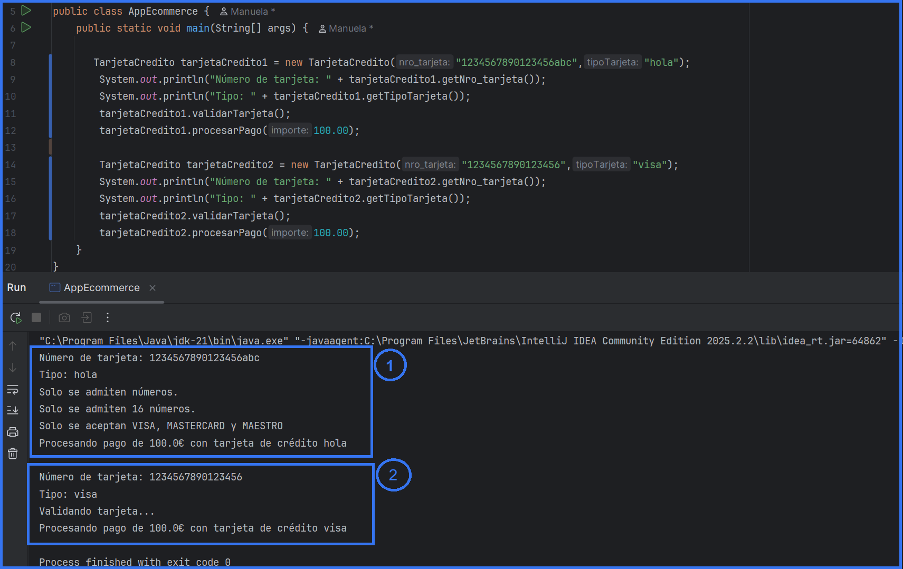
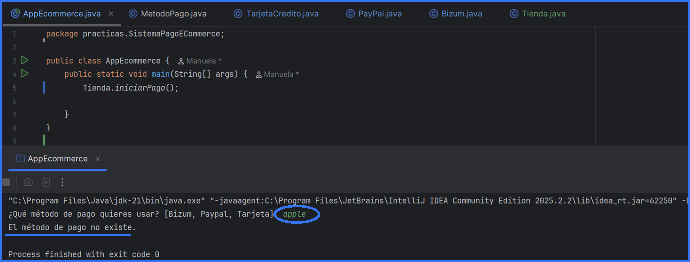
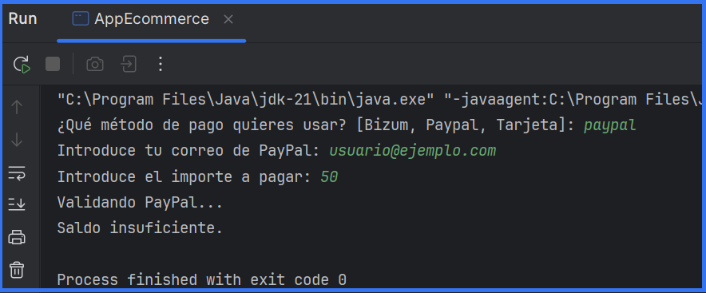

<p align="center">
  
</p>
<h1 align="center"> Práctica 1. Sistema de pago para un e-commerce </h1>
<h2 align="center"> Manuela Planelles - 1º DAW - IES Mutxamel</h2>

---
---

## Índice

1. [Introducción](#1-introducción)
2. [Objetivos de la práctica](#2-objetivos-de-la-práctica)
3. [Diseño e Implementación del programa](#3-diseño-e-implementación-del-programa)
   - [3.1. Estructura de clases](#31-estructura-de-clases)
     - [Clase AppEcommerce](#clase-appecommerce)
     - [Clase MetodoPago](#clase-metodopago)
     - [Clase TarjetaCredito](#clase-tarjetacredito)
     - [Clase PayPal](#clase-paypal)
     - [Clase Bizum](#clase-bizum)
     - [Clase Tienda](#clase-tienda)
4. [Relaciones entre clases](#4-relaciones-entre-clases)
5. [Plan de pruebas](#5-plan-de-pruebas)
   - [5.1. Ejemplo de funcionamiento](#51-ejemplo-de-funcionamiento)
   - [5.2. Pruebas finales](#52-pruebas-finales)
6. [Documentación Javadoc](#6-documentación-javadoc)
7. [Diagrama UML](#7-diagrama-uml)
8. [Conclusión](#8-conclusión)
    

---
---

## 1. Introducción

El presente documento recoge el desarrollo de la práctica número 1 de la asignatura de Programación, correspondiente al tema de Programación Orientada a Objetos.

El contexto de la práctica se centra en el desarrollo de un sistema de pagos para una tienda online de cursos de programación. La tienda debe aceptar diferentes métodos de pago (tarjeta de crédito, PayPal y Bizum), cada uno con su propia forma de procesar el pago, pero todos compartiendo la misma funcionalidad básica.

<p align="right"><a href="#índice">Ir al Índice</a></p>

---

## 2. Objetivos de la práctica

La práctica persigue los siguientes objetivos:

- Desarrollar una aplicación en Java que gestione diferentes métodos de pago para un e-commerce.
- Implementar herencia mediante una clase abstracta `MetodoPago` y tres subclases concretas.
- Aplicar polimorfismo para tratar diferentes métodos de pago de forma uniforme.
- Utilizar abstracción para definir comportamientos comunes sin implementar detalles específicos.
- Implementar validaciones específicas para cada método de pago (formato de tarjeta, correo electrónico, teléfono, PIN, saldo).
- Desarrollar métodos de validación de datos con diferentes criterios según el tipo de pago.
- Generar valores aleatorios (PIN de Bizum) de forma automática.
- Modularizar el código en métodos auxiliares para mantener el código organizado.

<p align="right"><a href="#índice">Ir al Índice</a></p>

---

## 3. Diseño e Implementación del programa

### 3.1. Estructura de clases

En esta práctica se desarrolla el código clase por clase. Lo primero que hacemos es crear la clase principal `AppEcommerce` para realizar las comprobaciones y, a continuación, seguimos el orden marcado en el PDF, creando cada clase con sus respectivos métodos.


---

#### Clase `AppEcommerce`

Clase principal que ejecuta la aplicación llamando al método `iniciarPago()` de la clase `Tienda`.

```java
public class AppEcommerce {
    public static void main(String[] args) {
        Tienda.iniciarPago();
    }
}
```

---

#### Clase `MetodoPago`

> _"Una clase abstracta llamada MetodoPago, con el siguiente método abstracto: void procesarPago(double importe)"_

Declaramos una clase abstracta. El método no tiene implementación (las subclases deben implementarlo) y recibe como parámetro el importe a pagar según indica el PDF.

```java
public abstract class MetodoPago {
    
    public abstract void procesarPago(double importe);
}
```

---

#### Clase `TarjetaCredito`

> _"La clase TarjetaCredito tendrá los atributos nro_tarjeta (String de 16 caracteres) y tipo (String que debe permitir solamente los siguientes valores: VISA, MASTERCARD, MAESTRO)."_

Creamos la clase que extiende de `MetodoPago`, los atributos, el constructor, getters/setters y toString.

```java
public class TarjetaCredito extends MetodoPago {

    private String nro_tarjeta;
    private String tipoTarjeta;

    public TarjetaCredito(String nro_tarjeta, String tipoTarjeta) {
        this.nro_tarjeta = nro_tarjeta;
        this.tipoTarjeta = tipoTarjeta;
    }
   
    public String getNro_tarjeta() {
        return nro_tarjeta;
    }

    public void setNro_tarjeta(String nro_tarjeta) {
        this.nro_tarjeta = nro_tarjeta;
    }

    public String getTipoTarjeta() {
        return tipoTarjeta;
    }

    public void setTipoTarjeta(String tipoTarjeta) {
        this.tipoTarjeta = tipoTarjeta;
    }
    
    @Override
    public String toString() {
        return "TarjetaCredito{" +
                "nro_tarjeta='" + nro_tarjeta + '\'' +
                ", tipoTarjeta='" + tipoTarjeta + '\'' +
                '}';
    }
}
```

> _"El método procesarPago() debe imprimir 'Procesando pago de [importe] € con tarjeta de crédito [tipo]'."_

Al no ser un método nuevo, sino que estamos sobrescribiendo (implementando) el método abstracto de la clase padre, utilizamos la anotación `@Override`. Esta anotación ayuda a detectar errores si nos equivocamos en el nombre o los parámetros.

```java
@Override
public void procesarPago(double importe) {
    System.out.println("Procesando pago de " + importe + " € con tarjeta de crédito " + tipoTarjeta);
}
```

> _"Debe haber un método más en la clase para validarTarjeta(), que compruebe que el nro_tarjeta introducido tenga la longitud esperada y el tipo esté dentro de los valores permitidos."_

Creamos el método `validarTarjeta()` que devuelve boolean. Usamos `.matches("\\d+")` donde `\\d` representa cualquier dígito (0-9) y el `+` indica "uno o más", validando que toda la cadena contenga solo números. Usamos `.length()` para verificar que tenga exactamente 16 caracteres. Usamos `.equalsIgnoreCase()` para validar el tipo de tarjeta sin importar mayúsculas/minúsculas.

```java
public boolean validarTarjeta() {
    boolean valida = true;
    
    if (!nro_tarjeta.matches("\\d+")) {
        System.out.println("Los datos de tu tarjeta no son correctos.");
        System.out.println("  - El número solo puede contener dígitos.");
        valida = false;
    }

    if (nro_tarjeta.length() != 16) {
        System.out.println("Los datos de tu tarjeta no son correctos.");
        System.out.println("  - El número debe tener exactamente 16 dígitos.");
        valida = false;
    }

    if (!tipoTarjeta.equalsIgnoreCase("VISA") &&
        !tipoTarjeta.equalsIgnoreCase("MASTERCARD") &&
        !tipoTarjeta.equalsIgnoreCase("MAESTRO")) {
        System.out.println("Los datos de tu tarjeta no son correctos.");
        System.out.println("  - Solo se aceptan VISA, MASTERCARD y MAESTRO.");
        valida = false;
    }
    
    if (valida) {
        System.out.println("Validando tarjeta...");
    }

    return valida;
}
```

<details>
<summary>Ver el código completo de la clase TarjetaCredito</summary>
  
```java
public class TarjetaCredito extends MetodoPago {

    private String nro_tarjeta;
    private String tipoTarjeta;

    public TarjetaCredito(String nro_tarjeta, String tipoTarjeta) {
        this.nro_tarjeta = nro_tarjeta;
        this.tipoTarjeta = tipoTarjeta;
    }
    
    public boolean validarTarjeta() {
        boolean valida = true;
        
        if (!nro_tarjeta.matches("\\d+")) {
            System.out.println("Los datos de tu tarjeta no son correctos.");
            System.out.println("  - El número solo puede contener dígitos.");
            valida = false;
        }

        if (nro_tarjeta.length() != 16) {
            System.out.println("Los datos de tu tarjeta no son correctos.");
            System.out.println("  - El número debe tener exactamente 16 dígitos.");
            valida = false;
        }

        if (!tipoTarjeta.equalsIgnoreCase("VISA") &&
            !tipoTarjeta.equalsIgnoreCase("MASTERCARD") &&
            !tipoTarjeta.equalsIgnoreCase("MAESTRO")) {
            System.out.println("Los datos de tu tarjeta no son correctos.");
            System.out.println("  - Solo se aceptan VISA, MASTERCARD y MAESTRO.");
            valida = false;
        }
        
        if (valida) {
            System.out.println("Validando tarjeta...");
        }

        return valida;
    }

    public String getNro_tarjeta() {
        return nro_tarjeta;
    }

    public void setNro_tarjeta(String nro_tarjeta) {
        this.nro_tarjeta = nro_tarjeta;
    }

    public String getTipoTarjeta() {
        return tipoTarjeta;
    }

    public void setTipoTarjeta(String tipoTarjeta) {
        this.tipoTarjeta = tipoTarjeta;
    }
    
    @Override
    public String toString() {
        return "TarjetaCredito{" +
                "nro_tarjeta='" + nro_tarjeta + '\'' +
                ", tipoTarjeta='" + tipoTarjeta + '\'' +
                '}';
    }
    
    @Override
    public void procesarPago(double importe) {
        System.out.println("Procesando pago de " + importe + " € con tarjeta de crédito " + tipoTarjeta);
    }
}
```
</details>

[Comprobación](#1-comprobacion-clase-tarjetacredito)

---

#### Clase `PayPal`

> _"La clase PayPal tendrá los atributos cuenta (String con formato de correo electrónico 'xxx@xxx.com') y saldo (double por defecto 23€)."_

Creamos la clase que extiende de `MetodoPago`, con los atributos, constructor, getters/setters y toString. Dejamos marcado por defecto los 23€ dentro del constructor.

```java
public class PayPal extends MetodoPago {
    private String correo;
    private double saldo;

    public PayPal(String correo) {
        this.correo = correo;
        this.saldo = 23.0;
    }

    public String getCorreo() {
        return correo;
    }

    public void setCorreo(String correo) {
        this.correo = correo;
    }

    public double getSaldo() {
        return saldo;
    }

    public void setSaldo(double saldo) {
        this.saldo = saldo;
    }

    @Override
    public String toString() {
        return "PayPal{" +
                "correo='" + correo + '\'' +
                ", saldo=" + saldo +
                '}';
    }
}
```

> _"El método procesarPago() debe imprimir 'Procesando pago de [importe] € con PayPal'."_

Tal cual se hizo en la clase de tarjeta, se sobrescribe el método del padre.

```java
@Override
public void procesarPago(double importe) {
    System.out.println("Procesando pago de " + importe + " € con PayPal.");
}
```

> _"En este caso, el método validarPayPal() debe comprobar que el formato del correo electrónico es correcto y que el saldo de la cuenta sea suficiente para realizar el pago correspondiente."_

Repetimos el mismo tipo de estructura que con `validarTarjeta()`, con boolean para las validaciones y utilizamos if. Para el correo validamos que contenga el `@` con `.contains()` y para el saldo indicamos que si el saldo es inferior al importe, que salte el error.

```java
public boolean validarPayPal(double importe) {
    boolean valido = true;
    
    if (!correo.contains("@")) {
        System.out.println("Los datos de tu cuenta PayPal no son correctos.");
        System.out.println("  - El formato del correo no es válido.");
        valido = false;
    }
    
    if (saldo < importe) {
        System.out.println("Los datos de tu cuenta PayPal no son correctos.");
        System.out.println("  - Saldo insuficiente. Tienes " + saldo + "€ y necesitas " + importe + "€.");
        valido = false;
    }
    
    if (valido) {
        System.out.println("Validando PayPal...");
    }
    
    return valido;
}
```

<details>
<summary>Ver el código completo de la clase PayPal</summary>
  
```java
public class PayPal extends MetodoPago {
    private String correo;
    private double saldo;

    public PayPal(String correo) {
        this.correo = correo;
        this.saldo = 23.0;
    }

    public boolean validarPayPal(double importe) {
        boolean valido = true;
        
        if (!correo.contains("@")) {
            System.out.println("Los datos de tu cuenta PayPal no son correctos.");
            System.out.println("  - El formato del correo no es válido.");
            valido = false;
        }
        
        if (saldo < importe) {
            System.out.println("Los datos de tu cuenta PayPal no son correctos.");
            System.out.println("  - Saldo insuficiente. Tienes " + saldo + "€ y necesitas " + importe + "€.");
            valido = false;
        }
        
        if (valido) {
            System.out.println("Validando PayPal...");
        }
        
        return valido;
    }

    public String getCorreo() {
        return correo;
    }

    public void setCorreo(String correo) {
        this.correo = correo;
    }

    public double getSaldo() {
        return saldo;
    }

    public void setSaldo(double saldo) {
        this.saldo = saldo;
    }

    @Override
    public String toString() {
        return "PayPal{" +
                "correo='" + correo + '\'' +
                ", saldo=" + saldo +
                '}';
    }

    @Override
    public void procesarPago(double importe) {
        System.out.println("Procesando pago de " + importe + " € con PayPal.");
    }
}
```
</details>

[Comprobación](#2-comprobacion-clase-paypal)

---

#### Clase `Bizum`

> _"La clase Bizum tendrá los atributos telefono (String de 9 caracteres) y pin (int de 6 dígitos que se generará de forma aleatoria)."_

Como se indica, creamos los atributos, el constructor y los getters/setters y toString. Dentro del constructor generamos un PIN aleatorio de 6 dígitos usando `Random`. La expresión `random.nextInt(900000) + 100000` genera números entre 100000 y 999999. Según indica el PDF, imprimimos el PIN para poder realizar pruebas.

```java
import java.util.Random;
import java.util.Scanner;

public class Bizum extends MetodoPago {
    private String telefono;
    private int pin;

    public Bizum(String telefono) {
        this.telefono = telefono;
        Random random = new Random();
        this.pin = random.nextInt(900000) + 100000;
        System.out.println("[chivato PIN] " + pin);
    }

    public String getTelefono() {
        return telefono;
    }

    public void setTelefono(String telefono) {
        this.telefono = telefono;
    }

    public int getPin() {
        return pin;
    }

    public void setPin(int pin) {
        this.pin = pin;
    }

    @Override
    public String toString() {
        return "Bizum{" +
                "telefono='" + telefono + '\'' +
                ", pin=" + pin +
                '}';
    }
}
```

> _"El método procesarPago() debe imprimir 'Procesando pago de [importe] € con Bizum'."_

Tal cual se hizo en las clases anteriores, se sobrescribe el método del padre.

```java
@Override
public void procesarPago(double importe) {
    System.out.println("Procesando pago de " + importe + " € con Bizum.");
}
```

> _"El método validarBizum() debe comprobar el formato del teléfono y que el pin introducido por el usuario es el correcto. NOTA: haz trampa e imprime el pin en cuanto se genere para poder ver cuál es y poder realizar el pago."_

La validación del teléfono es similar a la de la tarjeta de crédito. Primero verificamos que solo contenga números con `.matches("\\d+")`. Luego verificamos que tenga exactamente 9 caracteres con `.length()`. Para el PIN, usamos `Scanner` para pedir al usuario que introduzca el PIN y comparamos con el PIN generado aleatoriamente. Si son diferentes, la validación falla.

```java
public boolean validarBizum() {
    boolean valido = true;

    if (!telefono.matches("\\d+")) {
        System.out.println("Los datos de tu Bizum no son correctos.");
        System.out.println("  - El teléfono solo puede contener números.");
        valido = false;
    }
    
    if (telefono.length() != 9) {
        System.out.println("Los datos de tu Bizum no son correctos.");
        System.out.println("  - El teléfono debe tener exactamente 9 dígitos.");
        valido = false;
    }

    Scanner scanner = new Scanner(System.in);
    System.out.print("Introduce tu PIN: ");
    int pinIntroducido = scanner.nextInt();

    if (pinIntroducido != this.pin) {
        System.out.println("Los datos de tu Bizum no son correctos.");
        System.out.println("  - El PIN introducido es incorrecto.");
        valido = false;
    }
    
    if (valido) {
        System.out.println("Validando Bizum...");
    }

    return valido;
}
```

<details>
<summary>Ver el código completo de la clase Bizum</summary>
  
```java
import java.util.Random;
import java.util.Scanner;

public class Bizum extends MetodoPago {
    private String telefono;
    private int pin;

    public Bizum(String telefono) {
        this.telefono = telefono;
        Random random = new Random();
        this.pin = random.nextInt(900000) + 100000;
        System.out.println("[chivato PIN] " + pin);
    }
    
    public boolean validarBizum() {
        boolean valido = true;

        if (!telefono.matches("\\d+")) {
            System.out.println("Los datos de tu Bizum no son correctos.");
            System.out.println("  - El teléfono solo puede contener números.");
            valido = false;
        }
        
        if (telefono.length() != 9) {
            System.out.println("Los datos de tu Bizum no son correctos.");
            System.out.println("  - El teléfono debe tener exactamente 9 dígitos.");
            valido = false;
        }

        Scanner scanner = new Scanner(System.in);
        System.out.print("Introduce tu PIN: ");
        int pinIntroducido = scanner.nextInt();

        if (pinIntroducido != this.pin) {
            System.out.println("Los datos de tu Bizum no son correctos.");
            System.out.println("  - El PIN introducido es incorrecto.");
            valido = false;
        }
        
        if (valido) {
            System.out.println("Validando Bizum...");
        }

        return valido;
    }

    public String getTelefono() {
        return telefono;
    }

    public void setTelefono(String telefono) {
        this.telefono = telefono;
    }

    public int getPin() {
        return pin;
    }

    public void setPin(int pin) {
        this.pin = pin;
    }

    @Override
    public String toString() {
        return "Bizum{" +
                "telefono='" + telefono + '\'' +
                ", pin=" + pin +
                '}';
    }

    @Override
    public void procesarPago(double importe) {
        System.out.println("Procesando pago de " + importe + " € con Bizum.");
    }
}
```
</details>

[Comprobación](#3-comprobacion-clase-bizum)

---

#### Clase `Tienda`

> _"Tendremos otra clase Tienda con un método estático: static void realizarPago(MetodoPago metodo) que pedirá el importe a pagar e invocará al método procesarPago() según el tipo de objeto metodo recibido como parámetro."_

Creamos el método static que se solicita. Usamos `Scanner` para leer el importe introducido por el usuario y llamamos al método `procesarPago()` del objeto recibido. Gracias al polimorfismo, Java ejecuta automáticamente el método correcto según el tipo real del objeto (TarjetaCredito, PayPal o Bizum).

```java
public static void realizarPago(MetodoPago metodo) {
    Scanner scanner = new Scanner(System.in);
    System.out.print("Introduce el importe a pagar: ");
    double importe = scanner.nextDouble();
    
    metodo.procesarPago(importe);
    System.out.println("Pago aceptado. Muchas gracias.");
}
```

> _"Además, esta clase tendrá otro método estático iniciarPago(), donde previamente preguntará al usuario qué método de pago quiere usar para crear uno nuevo y realizar todas las validaciones correspondientes (validarTarjeta, validarPayPal, validarBizum) antes de ser procesado."_

Creamos el método `iniciarPago()`. Este método funciona como un menú inicial donde el usuario elige su método de pago. Usamos un switch para gestionar las diferentes opciones de forma más limpia y legible que con múltiples if-else. Cada case pide por consola los datos necesarios para ese método de pago y, mediante un if, verificamos que la validación sea correcta antes de procesar el pago.

```java
public static void iniciarPago() {
    Scanner scanner = new Scanner(System.in);
    System.out.print("¿Qué método de pago quieres usar? [Bizum, Paypal, Tarjeta]: ");
    String metodo = scanner.nextLine();

    MetodoPago metodoPago = null;

    switch (metodo.toLowerCase()) {

        case "tarjeta":
            System.out.println("Introduce los datos de tu tarjeta:");
            String numeroTarjeta = scanner.nextLine();

            System.out.print("Selecciona el tipo de tarjeta [VISA, MAESTRO, MASTERCARD]: ");
            String tipoTarjeta = scanner.nextLine();

            TarjetaCredito tarjeta = new TarjetaCredito(numeroTarjeta, tipoTarjeta);

            System.out.println("Validando tarjeta...");
            if (tarjeta.validarTarjeta()) {
                metodoPago = tarjeta;
            }
            break;

        case "paypal":
            System.out.print("Introduce tu correo de PayPal: ");
            String correoPayPal = scanner.nextLine();

            PayPal paypal = new PayPal(correoPayPal);

            System.out.print("Introduce el importe a pagar: ");
            double importePayPal = scanner.nextDouble();

            System.out.println("Validando PayPal...");
            if (paypal.validarPayPal(importePayPal)) {
                metodoPago = paypal;
            }
            break;

        case "bizum":
            System.out.print("Introduce tu número de teléfono vinculado con Bizum: ");
            String telefonoBizum = scanner.nextLine();

            Bizum bizum = new Bizum(telefonoBizum);

            System.out.println("Validando Bizum...");
            if (bizum.validarBizum()) {
                metodoPago = bizum;
            }
            break;

        default:
            System.out.println("El método de pago no existe.");
            return;
    }

    if (metodoPago != null) {
        realizarPago(metodoPago);
    }
}
```

<details>
<summary>Ver el código completo de la clase Tienda</summary>
  
```java
import java.util.Scanner;

public class Tienda {
    
    public static void realizarPago(MetodoPago metodo) {
        Scanner scanner = new Scanner(System.in);
        System.out.print("Introduce el importe a pagar: ");
        double importe = scanner.nextDouble();
        
        metodo.procesarPago(importe);
        System.out.println("Pago aceptado. Muchas gracias.");
    }

    public static void iniciarPago() {
        Scanner scanner = new Scanner(System.in);
        System.out.print("¿Qué método de pago quieres usar? [Bizum, Paypal, Tarjeta]: ");
        String metodo = scanner.nextLine();

        MetodoPago metodoPago = null;

        switch (metodo.toLowerCase()) {

            case "tarjeta":
                System.out.println("Introduce los datos de tu tarjeta:");
                String numeroTarjeta = scanner.nextLine();

                System.out.print("Selecciona el tipo de tarjeta [VISA, MAESTRO, MASTERCARD]: ");
                String tipoTarjeta = scanner.nextLine();

                TarjetaCredito tarjeta = new TarjetaCredito(numeroTarjeta, tipoTarjeta);

                System.out.println("Validando tarjeta...");
                if (tarjeta.validarTarjeta()) {
                    metodoPago = tarjeta;
                }
                break;

            case "paypal":
                System.out.print("Introduce tu correo de PayPal: ");
                String correoPayPal = scanner.nextLine();

                PayPal paypal = new PayPal(correoPayPal);

                System.out.print("Introduce el importe a pagar: ");
                double importePayPal = scanner.nextDouble();

                System.out.println("Validando PayPal...");
                if (paypal.validarPayPal(importePayPal)) {
                    metodoPago = paypal;
                }
                break;

            case "bizum":
                System.out.print("Introduce tu número de teléfono vinculado con Bizum: ");
                String telefonoBizum = scanner.nextLine();

                Bizum bizum = new Bizum(telefonoBizum);

                System.out.println("Validando Bizum...");
                if (bizum.validarBizum()) {
                    metodoPago = bizum;
                }
                break;

            default:
                System.out.println("El método de pago no existe.");
                return;
        }

        if (metodoPago != null) {
            realizarPago(metodoPago);
        }
    }
}
```
</details>

Las pruebas de esta clase se realizan con [las pruebas finales](#52-pruebas-finales)

<p align="right"><a href="#índice">Ir al Índice</a></p>

---

## 4. Relaciones entre clases

| Relación | Tipo | Descripción |
|----------|------|-------------|
| `TarjetaCredito` → `MetodoPago` | Herencia | TarjetaCredito extiende MetodoPago e implementa `procesarPago()` |
| `PayPal` → `MetodoPago` | Herencia | PayPal extiende MetodoPago e implementa `procesarPago()` |
| `Bizum` → `MetodoPago` | Herencia | Bizum extiende MetodoPago e implementa `procesarPago()` |
| `Tienda` — `MetodoPago` | Uso/Dependencia | Tienda utiliza objetos de tipo MetodoPago mediante polimorfismo |
| `AppEcommerce` → `Tienda` | Llamada | AppEcommerce invoca métodos estáticos de Tienda |

**Jerarquía de herencia:**

```
        MetodoPago (abstracta)
               |
   +-----------+-----------+
   |           |           |
TarjetaCredito PayPal   Bizum

```

**Explicación de las relaciones:**

- **Herencia**: Las tres clases de pago (TarjetaCredito, PayPal, Bizum) heredan de MetodoPago, reutilizando la estructura base y añadiendo sus características específicas.

- **Polimorfismo**: El método `realizarPago(MetodoPago metodo)` puede recibir cualquier subclase de MetodoPago. Java ejecuta automáticamente el método `procesarPago()` correcto según el tipo real del objeto.

- **Abstracción**: La clase MetodoPago define el comportamiento común (procesarPago) sin implementar los detalles, que quedan en manos de las subclases.

<p align="right"><a href="#índice">Ir al Índice</a></p>

---

## 5. Plan de pruebas

### 5.1. Ejemplo de funcionamiento

#### 1. Comprobacion clase TarjetaCredito

Creamos dos tarjetas: una con errores (número con letras y más de 16 dígitos, y tipo de tarjeta no válido) y otra tarjeta correcta.



#### 2. Comprobacion clase PayPal

Creamos dos cuentas: una sin el arroba y con saldo insuficiente, y otra con "@" y saldo suficiente.


#### 3. Comprobacion clase Bizum

Creamos dos cuentas: una con menos de 9 dígitos para el teléfono e introducimos mal el PIN, y la otra correcta.


### 5.2. Pruebas finales

- **Método incorrecto:**



- **Pago con tarjeta:**

Correcto:


Incorrecto:


- **Pago con PayPal:**

Correcto:


Incorrecto:





- **Pago con Bizum:**

Correcto:


Incorrecto:


<p align="right"><a href="#índice">Ir al Índice</a></p>

---

## 6. Documentación Javadoc

Se comentan todas las clases tanto en la cabecera como en los métodos usando las etiquetas:

| Etiqueta | Uso | Ubicación |
|----------|------|-------------|
| `@author` | Nombre del autor | Clases |
| `@version` | Versión del código | Clases (opcional) |
| `@param` | Descripción de parámetros | Constructores y métodos con parámetros |
| `@return` | Descripción del valor devuelto | Métodos que no son void ni constructores |
| `@see` | Referencias cruzadas a otros métodos/clases | Donde sea relevante |
| `@Override` | Indica sobrescritura de método | Métodos procesarPago() y toString() |

**Ejemplo de documentación aplicada:**

```java
/**
 * Clase abstracta que representa un método de pago genérico
 * @author Manuela Planelles
 * @see TarjetaCredito
 * @see PayPal
 * @see Bizum
 */
public abstract class MetodoPago {
    /**
     * Procesa un pago con el método de pago actual
     * @param importe Cantidad a pagar en euros
     */
    public abstract void procesarPago(double importe);
}
```

- Se adjunta en la misma carpeta del proyecto los zip la documentacion de JavaDoc.

  
  
<p align="right"><a href="#índice">Ir al Índice</a></p>

---

## 7. Diagrama UML

Solicitamos a ChartGPT que nos cree un codigo de un diagrama de relación entre varias clases parea PlantUML.

  

  Ver el código para PlantUML
  <details>
<summary>Ver el código completo de la clase Tienda</summary>
  
```java
@startuml
skinparam classAttributeIconSize 0

package practicas.SistemaPagoECommerce {

    class AppEcommerce {
        + {static} main(args: String[])
    }

    abstract class MetodoPago {
        + MetodoPago()
        + {abstract} procesarPago(importe: double)
    }

    class TarjetaCredito {
        - nro_tarjeta: String
        - tipoTarjeta: String
        + TarjetaCredito(nro_tarjeta: String, tipoTarjeta: String)
        + validarTarjeta(): boolean
        + getNro_tarjeta(): String
        + setNro_tarjeta(nro_tarjeta: String)
        + getTipoTarjeta(): String
        + setTipoTarjeta(tipoTarjeta: String)
        + toString(): String
        + procesarPago(importe: double)
    }

    class Bizum {
        - telefono: String
        - pin: int
        + Bizum(telefono: String)
        + validarBizum(): boolean
        + getTelefono(): String
        + setTelefono(telefono: String)
        + getPin(): int
        + setPin(pin: int)
        + toString(): String
        + procesarPago(importe: double)
    }

    class PayPal {
        - correo: String
        + PayPal(correo: String)
        + validarPayPal(importe: double): boolean
        + procesarPago(importe: double)
    }

    class Tienda {
        + {static} realizarPago(metodo: MetodoPago)
        + {static} iniciarPago()
    }

    ' Relaciones de Herencia
    MetodoPago <|-- TarjetaCredito
    MetodoPago <|-- Bizum
    MetodoPago <|-- PayPal

    ' Relaciones de Dependencia y Uso
    AppEcommerce ..> Tienda : "inicia"
    Tienda ..> MetodoPago : "utiliza"
    Tienda ..> TarjetaCredito : "instancia"
    Tienda ..> Bizum : "instancia"
    Tienda ..> PayPal : "instancia"

}
@enduml
```

</details>

<p align="right"><a href="#índice">Ir al Índice</a></p>

---

## 8. Conclusión

Al principio, implementar herencia y polimorfismo parecía complicado, pero siguiendo el PDF paso a paso y entendiendo las relaciones entre clases, el desarrollo fue más claro.

Las principales dificultades fueron:

- **Validaciones específicas**: Tuve que revisar los apuntes de strings para recordar cómo hacer las validaciones de formato de tarjeta (16 dígitos), correos electrónicos (contiene @), teléfonos (9 dígitos) y la generación de PIN aleatorio usando Random.

- **Polimorfismo en la práctica**: Comprender cómo `realizarPago(MetodoPago metodo)` funciona con diferentes subclases sin conocer el tipo específico.

- **Flujo del programa**: Coordinar las validaciones antes de procesar el pago y manejar casos de error.

Consulté con la IA principalmente para realizar el Javadoc, ya que estuve leyendo que con subclases hay diferentes estructuras de etiquetas.

Esta práctica me ha ayudado a comprender la utilidad real de la herencia y el polimorfismo. Antes eran conceptos abstractos, pero ahora veo cómo facilitan la extensibilidad del código: añadir un nuevo método de pago solo requiere crear una nueva clase sin tocar el código existente.

Honestamente, necesito seguir practicando para conseguir más fluidez y confianza a la hora de estructurar el código, pero me veo mejor que cuando empecé y cada vez entiendo mejor los conceptos de POO.

<p align="right"><a href="#índice">Ir al Índice</a></p>

---
